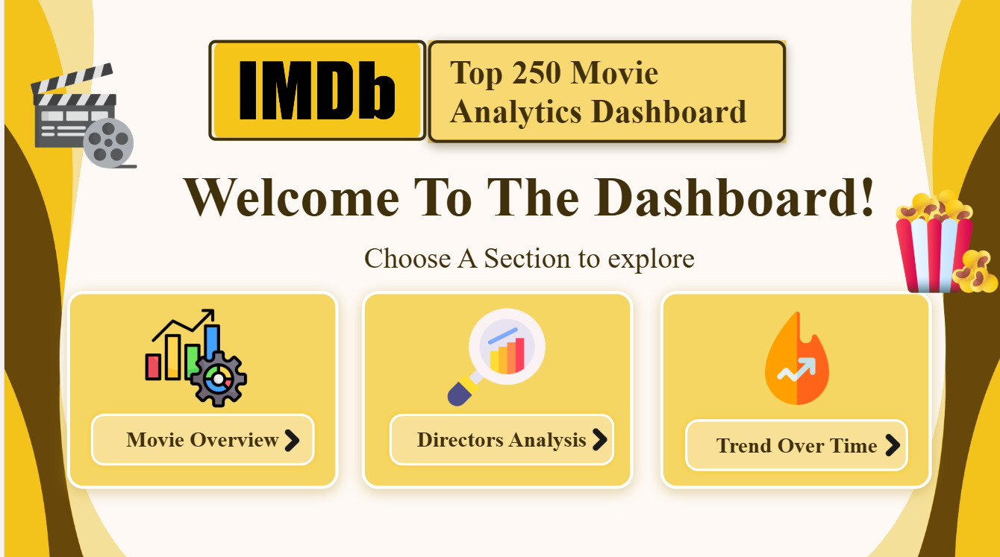
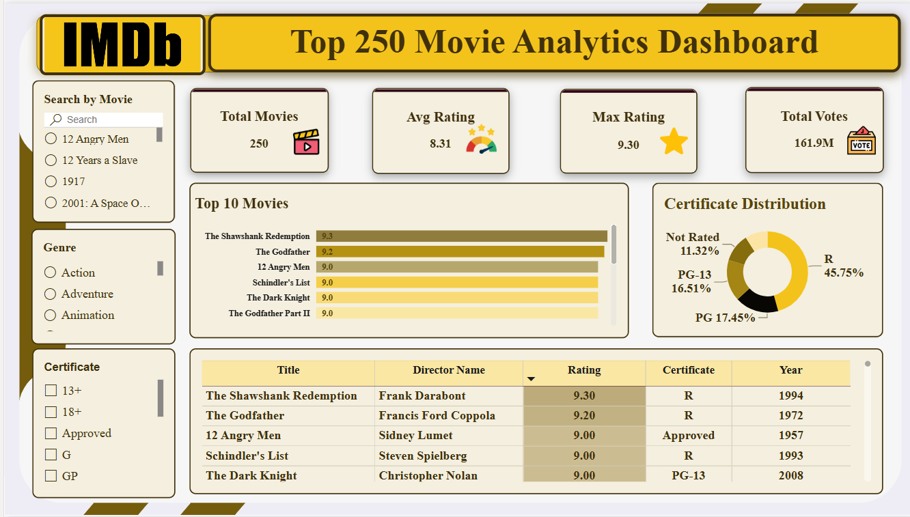
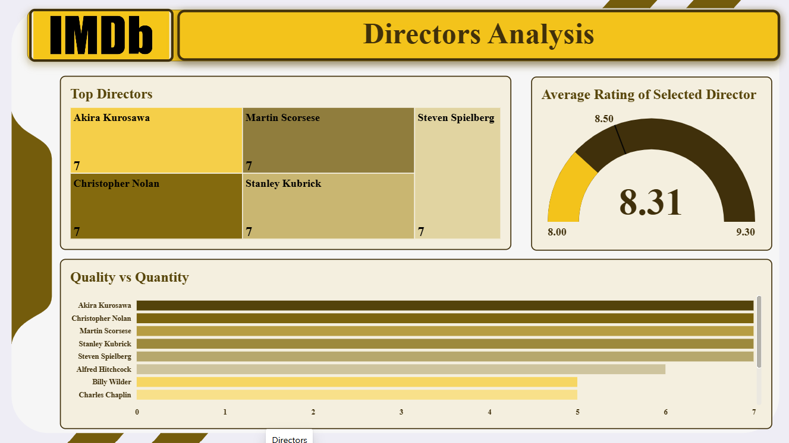
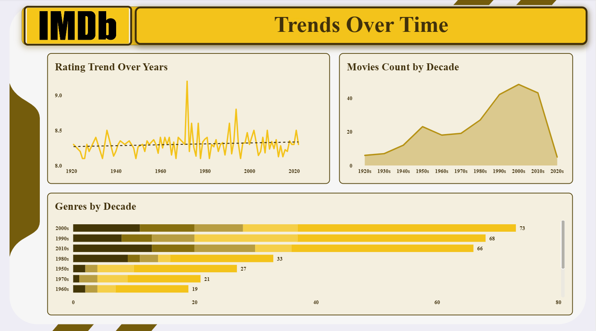

🎬 IMDb Top 250 Movie Analytics Dashboard

  <strong>📊 An Interactive Power BI Dashboard for IMDb Top 250 Movies</strong>

  🎥 Movies &nbsp; • &nbsp; ⭐ Ratings &nbsp; • &nbsp; 🎬 Directors &nbsp; • &nbsp; 🏷️ Genres &nbsp; • &nbsp; 📅 Trends

📌 Project Overview

This project is an interactive Power BI dashboard designed to analyze the IMDb Top 250 Movies and turn movie data into clear, engaging, and easy-to-explore insights.

The dashboard explores movie ratings, directors, genres, certificates, votes, release years, and trends over time through interactive visuals, filters, KPIs, and drill-through details.

🗺️ Dashboard Sections

🎞️ 1. Movie Overview

A high-level view of the IMDb Top 250 dataset, including:

🎯 Total Movies

⭐ Average Rating

🏆 Maximum Rating

🗳️ Total Votes

🥇 Top 10 Movies

🍿 Certificate Distribution

🔎 Movie Search

🎭 Genre Filter

🏷️ Certificate Filter

📋 Movie Details Table

🎬 2. Directors Analysis

A dedicated section for exploring directors and their movies:

🎥 Top Directors

📊 Quality vs. Quantity Analysis

⭐ Average Rating of Selected Director

🔍 Interactive director selection

📈 3. Trends Over Time

A time-based analysis of the movies in the dataset:

📉 Rating Trend Over Years

📅 Movies Count by Decade

🎭 Genres Distribution by Decade

🔎 4. Movie Details

A focused view of the selected movie:

🎬 Movie Title

🎥 Director

⭐ IMDb Rating

📅 Release Year

🛠️ Tools & Technologies

🧰 Tool / Skill

📌 Usage

📊 Power BI

Dashboard development and interactive reporting

🔢 Data Analysis

Exploring movie ratings, directors, genres, and trends

📈 Data Visualization

KPIs, charts, tables, and interactive visuals

🎨 Dashboard Design

Layout, navigation, visual hierarchy, and user experience

🔍 Interactive Reporting

Filters, search, selections, and drill-through

🎯 Project Objective

The main objective of this project was to transform movie data into an interactive and visually engaging analytics dashboard that makes it easier to explore:

⭐ Movie ratings

🎬 Director performance

🎭 Genre distribution

🏷️ Certificate distribution

🗳️ Number of votes

📅 Historical trends

🔎 Individual movie details

The project also focuses on presenting information in a way that allows users to move from a high-level overview to more detailed analysis.

📸 Dashboard Preview

🏠 Home Page

  

🎞️ Movie Overview

  

🎬 Directors Analysis

  

📈 Trends Over Time

  

🔎 Movie Details

  

✨ Key Features

🎯 Interactive KPIs
Quickly monitor the most important metrics.

🔎 Search & Filters
Explore movies based on title, genre, and certificate.

📊 Multiple Analytical Perspectives
Analyze movies from the perspective of ratings, directors, genres, and time.

🔄 Interactive Navigation
Move between different dashboard sections to explore the data.

🔍 Movie Details
Focus on an individual movie and view its key information.

📂 Repository Structure

IMDb-Top-250-Movie-Analytics/
│
├── 📄 README.md
│
├── 📁 Dashboard/
│   └── 📊 IMDb_Top_250_Dashboard.pbix
│
├── 📁 Screenshots/
│   ├── 🖼️ HomePage.png
│   ├── 🖼️ Overview.png
│   ├── 🖼️ Directors.png
│   ├── 🖼️ TrendsOverTime.png
│   └── 🖼️ MovieDetails.png
│
└── 📁 Demo/
    └── 🎥 Dashboard_Demo.mp4

💡 What I Learned

Through this project, I practiced:

📊 Building interactive Power BI dashboards

🎨 Designing a consistent dashboard layout

📈 Selecting appropriate visualizations for different analytical questions

🔎 Creating interactive filters and user-focused navigation

🎬 Analyzing movie data from multiple perspectives

🧠 Turning raw data into clear and meaningful visual insights

🚀 Project Goal

This project is part of my Data Analytics / Business Intelligence portfolio, demonstrating my ability to combine data analysis, visualization, dashboard design, and interactive reporting into one complete project.

⭐ If you find this project interesting, feel free to explore the dashboard and share your feedback!
